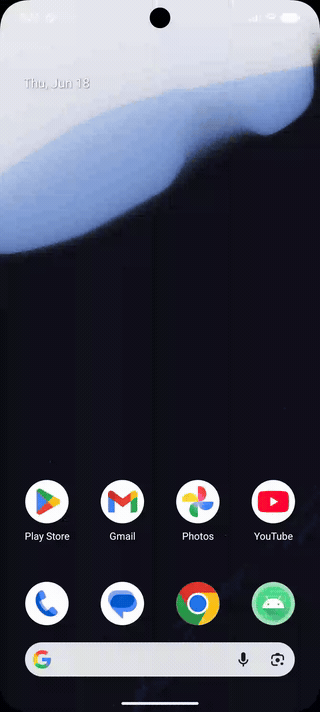

# ADK Assistant

A minimal Android sample that runs an AI **agent** inside the app using Google's
[Agent Development Kit (ADK) for Android](https://developer.android.com/ai/adk).

The agent is a cloud **Gemini** model wired up with two local, on-device tools:

- `getCurrentTime(timeZoneId)` — reads the device clock for any IANA time zone
- `getDeviceInfo()` — returns manufacturer / model / Android version

Ask it *"what time is it in Tokyo?"* or *"what phone is this?"* and the model
decides which tool to call, calls it, and answers from the result.

<p align="center">
  
</p>

## Architecture

Clean Architecture + **MVI**, with **Hilt** for DI and the **Navigation Component**
(Compose). Package: `in.singhangad.adkassistant`.

```
presentation/   MVI: ChatState / ChatIntent / ChatEffect, ChatViewModel, Compose UI, NavHost
   ↓ (use case)
domain/         framework-free: ChatMessage, AssistantRepository (interface), SendMessageUseCase
   ↑ (implements)
data/           ADK lives here: DeviceTools, AssistantAgentFactory, AssistantRepositoryImpl
di/             Hilt modules wiring runner + repository
```

| Piece | File |
|---|---|
| Tools the agent may call (`@Tool` / `@Param`) | [`data/agent/DeviceTools.kt`](app/src/main/java/in/singhangad/adkassistant/data/agent/DeviceTools.kt) |
| The agent (`LlmAgent` + `Gemini`) | [`data/agent/AssistantAgentFactory.kt`](app/src/main/java/in/singhangad/adkassistant/data/agent/AssistantAgentFactory.kt) |
| Conversation loop (`InMemoryRunner`) | [`data/repository/AssistantRepositoryImpl.kt`](app/src/main/java/in/singhangad/adkassistant/data/repository/AssistantRepositoryImpl.kt) |
| MVI ViewModel | [`presentation/chat/ChatViewModel.kt`](app/src/main/java/in/singhangad/adkassistant/presentation/chat/ChatViewModel.kt) |
| Compose chat UI | [`presentation/chat/ChatScreen.kt`](app/src/main/java/in/singhangad/adkassistant/presentation/chat/ChatScreen.kt) |
| Hilt wiring | [`di/`](app/src/main/java/in/singhangad/adkassistant/di) |

The KSP processor reads the `@Tool` annotations at compile time and generates
`generatedTools()`, which the agent uses to expose the functions to the model.

## Running it

1. Get a Gemini API key from [Google AI Studio](https://aistudio.google.com/apikey).
2. Put it in `local.properties` (git-ignored):
   ```properties
   GEMINI_API_KEY=your_key_here
   ```
3. `./gradlew :app:assembleDebug` (or run from Android Studio).

> The key is read into `BuildConfig` for convenience. That ships the key inside
> the APK — fine for a local sample, **not** for production. For a real app,
> route calls through a backend or Firebase AI Logic
> (`com.google.adk:google-adk-kotlin-firebase-android`).

## Build & test

```bash
./gradlew :app:assembleDebug        # build the debug APK
./gradlew :app:testDebugUnitTest    # JVM unit tests
./gradlew :app:connectedDebugAndroidTest   # instrumented UI test (needs a device/emulator)
```

## Requirements

- **minSdk 26** — the ADK AAR declares 26 even though the docs say 24.
- ADK `0.1.0`, KSP `2.3.9`, Kotlin `2.3.20`, AGP `9.0.1`, Hilt `2.59.2`,
  navigation-compose `2.9.8`.
- **Hilt ≥ 2.59** is required on AGP 9 — earlier versions fail with
  `Android BaseExtension not found` because AGP 9 removed that API.
- Note: the package `in.singhangad.adkassistant` uses `in`, a Kotlin hard
  keyword, so package/import statements escape it as `` `in` ``.

## On-device (Gemini Nano)

This sample uses cloud Gemini. ADK also supports running on-device via Gemini
Nano (ML Kit GenAI APIs) by swapping the `Gemini(...)` model for `GenaiPrompt`,
on an AICore-capable device. Same agent, same tools — just a different model.
